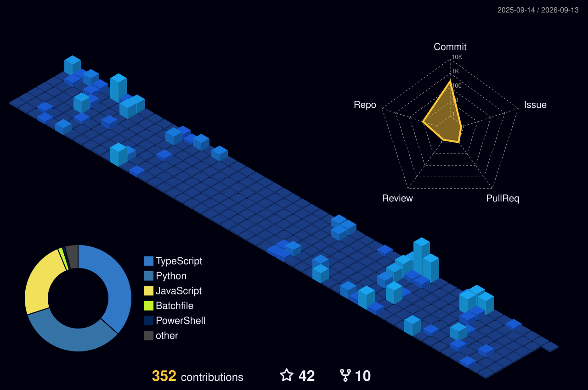

  <h1>👋 Hi, I'm Giovanni Guarino</h1>

  

  

    
    
    
    
  

---

## 🛠️ Tech Stack

  
  
  
  
  
  
  

---

## 🚀 Featured Projects

| Project | Description | Stars |
|---------|-------------|-------|
| [🎧 BluetoothDeviceConnector](https://github.com/ChromuSx/BluetoothDeviceConnector) | Connect Bluetooth devices on Windows with one click — AHK script + Elgato Stream Deck plugin | ⭐ 13 |
| [🚌 cotral](https://github.com/ChromuSx/cotral) | Telegram & Discord bot + REST API for Cotral public transport in Lazio, Italy | ⭐ 6 |
| [🎬 MediaButler](https://github.com/ChromuSx/MediaButler) | Smart Telegram bot that downloads and auto-organizes your media library — Docker ready | ⭐ 3 |
| [⏭️ SkipTubeAI](https://github.com/ChromuSx/SkipTubeAI) | Chrome extension that auto-skips sponsors and intros on YouTube using Claude AI / OpenAI | ⭐ 1 |
| [📝 RecapTubeAI](https://github.com/ChromuSx/RecapTubeAI) | Chrome extension that summarizes YouTube videos and auto-generates chapters using AI | ⭐ 1 |
| [🔐 SecurePress](https://github.com/ChromuSx/SecurePress) | Stream Deck plugin with Windows Hello biometric authentication | ⭐ 1 |

---

## 📊 GitHub Stats

  

---

## 🐍 Contribution Snake

  

## 🌆 3D Contribution Calendar

  

---

  
    
  <em>Made with ❤️ from Veroli, Italy 🇮🇹</em>

